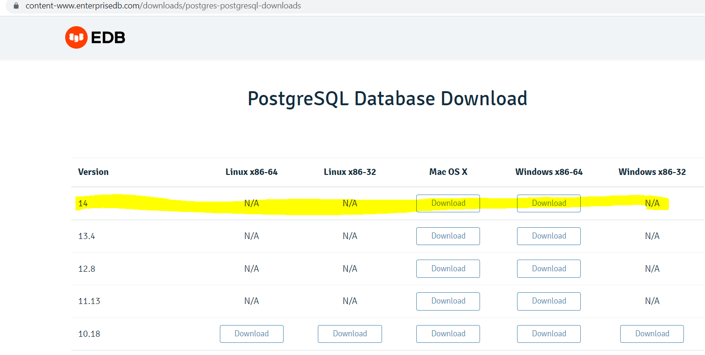
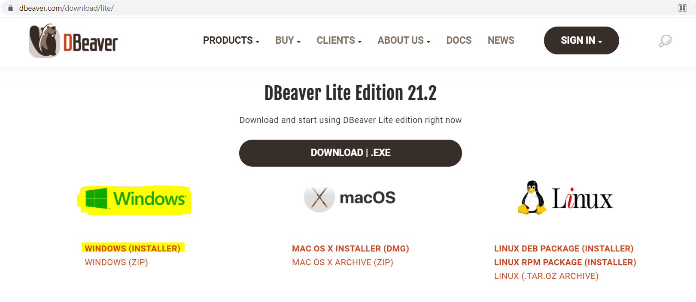
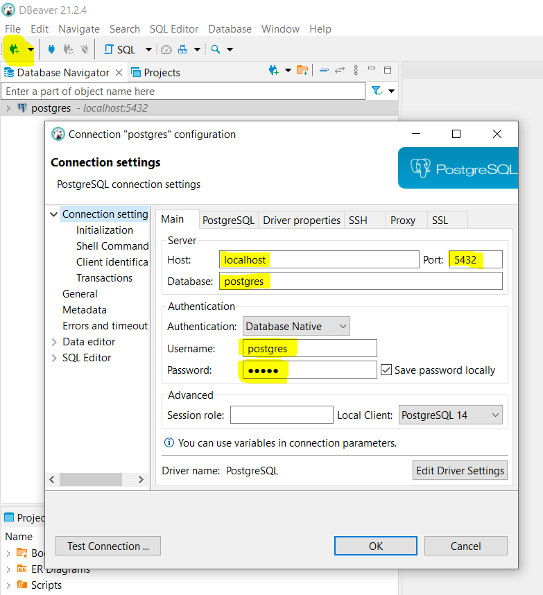
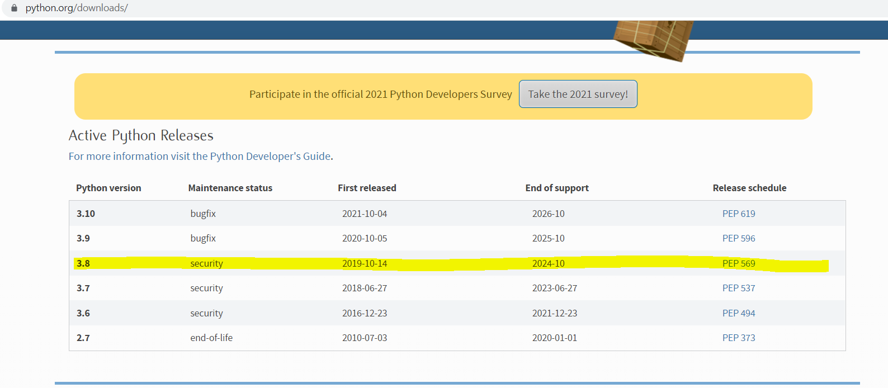
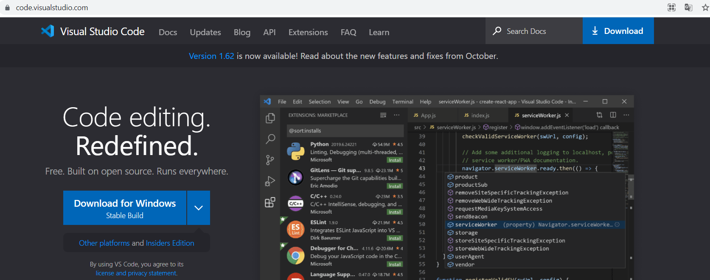
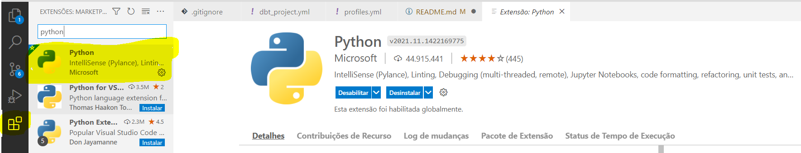
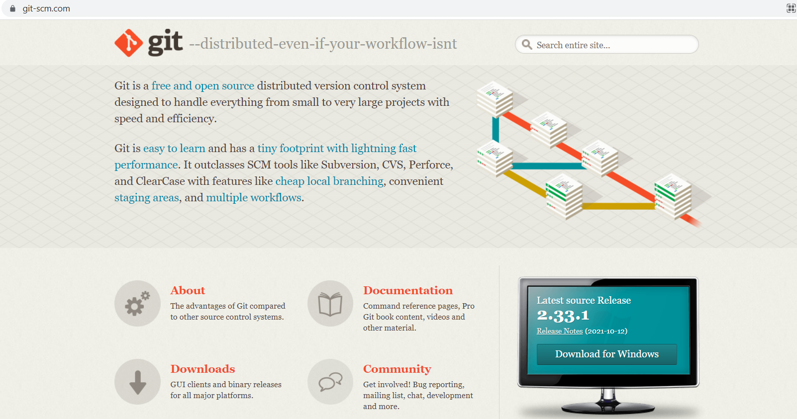
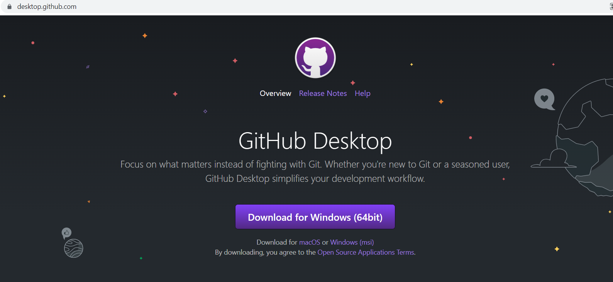
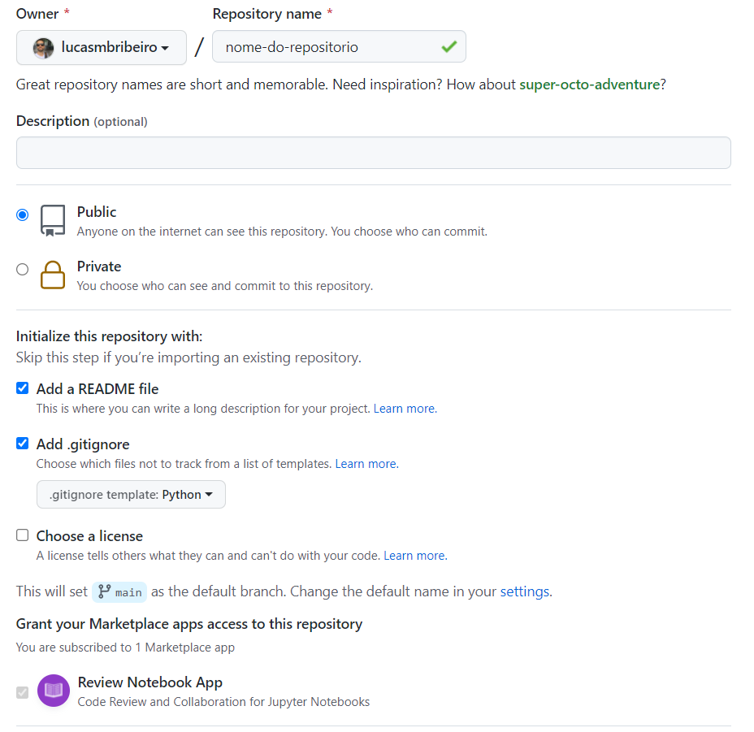

# [EM CONSTRUÇÃO] TUTORIAL PARA INICIAR A UTILIZAR O DBT

Esse repositório tem o objetivo de te ajudar a iniciar a utilização do DBT utilizando a versão gratuita.

Os passos descritos abaixo serão os mais detalhados possiveis e irei divir em grandes passos, assim você poderá ver o que se encaixa no seu cenário e ir realizando.

## PREMISSAS

Para esse tutorial vou seguir essas premissas:
* Vou utilizar o banco de dados PostgreSQL.
* Sistema Operacional: Windows
* Trabalhar de forma local com o DBT CLI. _linha de comando_

## GRANDES PASSOS

__1. Instalação das dependencias de banco de dados:__ Instalação do PostgreSQL e DBeaver.

__2. Dependencias para executar o DBT:__ Instalação do Python e VsCode para execução do DBT.

__3. Instalação e Configuração do DBT:__ Instalação da biblioteca do DBT e configuração do projeto para executar.

<br>

## __Instalação das dependencias de banco de dados__

__1.__ [__Instalação do PostgreSQL__](https://content-www.enterprisedb.com/downloads/postgres-postgresql-downloads)



* Nesse tutorial eu instalei a versão 14.
* A senha para o usuário root utilizada foi: ```admin```

__2.__ [__Instalação do DBeaver__](https://dbeaver.com/download/lite/)



* Instalei o DBeaver para verificar e executar consultas SQL para visualizar como estão os dados no banco de dados.

__3. Conexão com o PostgreSQL__



```
Host: localhost
Port: 5432 
Database: postgres

Username: postgres
Password: admin
```
<br>

## __Dependencias para executar o DBT__

__1.__ [__Instalação do Python 3.8__](https://content-www.enterprisedb.com/downloads/postgres-postgresql-downloads)



* Fique a vontade de instalar uma versão mais recente, utilizei a 3.8 pois já tenho na minha máquina local.

__2.__ [__Instalação do VS Code__](https://code.visualstudio.com/)



* Você irá precisar de uma IDE para executar seus comandos, eu escoli o vs code, mas fique a vontade de utilizar a que se sentir confortável.

__3.__ [__Dentro do VS Code, instalar a extensão do Python__](https://marketplace.visualstudio.com/items?itemName=ms-python.python)



* Você irá precisar instalar a extenção do Python pro vs code, na dúvida tem o link no tópico para download.

__4.__ [__Instalação do Git__](https://git-scm.com/)



* Caso não tenha instalado, será necessário instalar para levar seu código ao Github.

__5.__ [__Instalação do Github Desktop__](https://desktop.github.com/)



* Se não tiver familiariade com a linha de comando, o github desktop pode te ajudar bastante.

## __Instalação e Configuração do DBT__

__1. Criar um repositório no Github__



* É uma preferencia minha iniciar sempre com um README.
* E também adicionei o gitignore como Python, preferencia minha.

__2. Clonar o repositório para a máquina local__

Você tem duas opções: _utilize a que preferir_

* Usar a linha de comando para clonar seu reposítorio.
* Usar o Github Desktop para clonar seu reposítorio.

```
# Fui para a pasta onde deixo meus repositórios
cd C:\Users\lmbr4\Documents\GitHub

# Clonei o repositório dentro dessa pasta
git clone https://github.com/lucasmbribeiro/exemplo-dbt.git
```

__3. Criar o ambiente environment do Python__

Vamos criar um ambiente virtual do Python para isolar dos demais.

```
# Escolho a pasta onde vou criar a venv 
# Eu tenho uma pasta para armazenar os ambientes vistuais

python -m venv c:\venv_python\dbt-venv

```